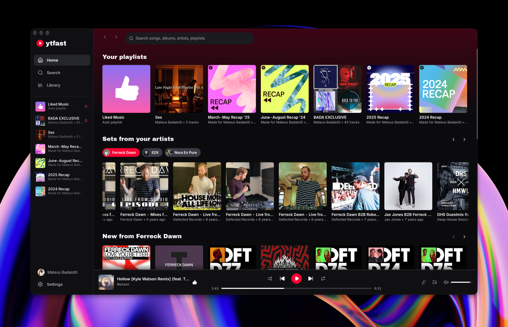

# ytfast

A fast, native YouTube Music app for macOS, Windows and Linux.

Everything a music app should have: your library and playlists, likes, lyrics, the queue, shuffle and repeat, crossfade and an equalizer. Home is yours to arrange: your playlists, long sets and new releases from the artists you pick, and only the YouTube sections you want.

## Install

- **macOS:** `brew install --cask mateusbadalotti/tap/ytfast`
- **Windows and Linux:** download the app from the [latest release](https://github.com/mateusbadalotti/ytfast/releases/latest).

To sign in, open music.youtube.com in your browser and sign in there, then choose that browser in ytfast's Settings. If macOS blocks the app the first time, allow it in System Settings → Privacy & Security.

ytfast is unofficial and not affiliated with Google or YouTube. MIT license.
